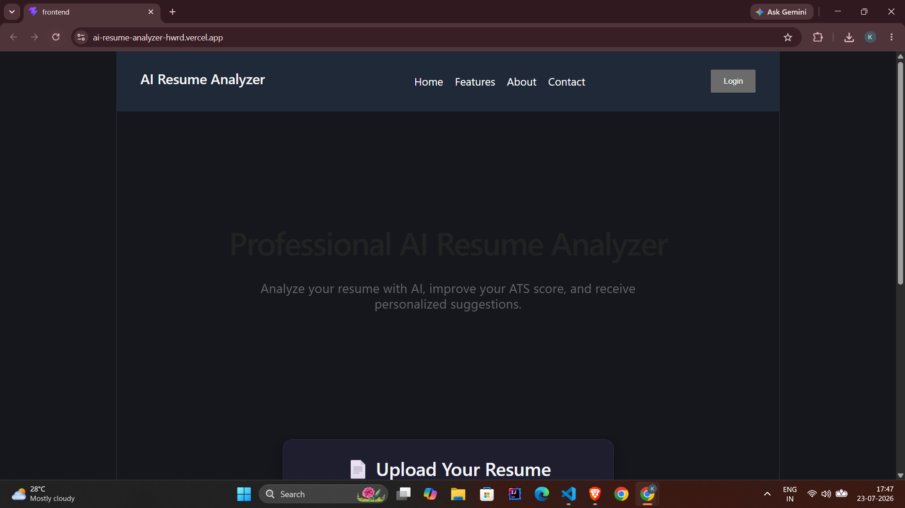
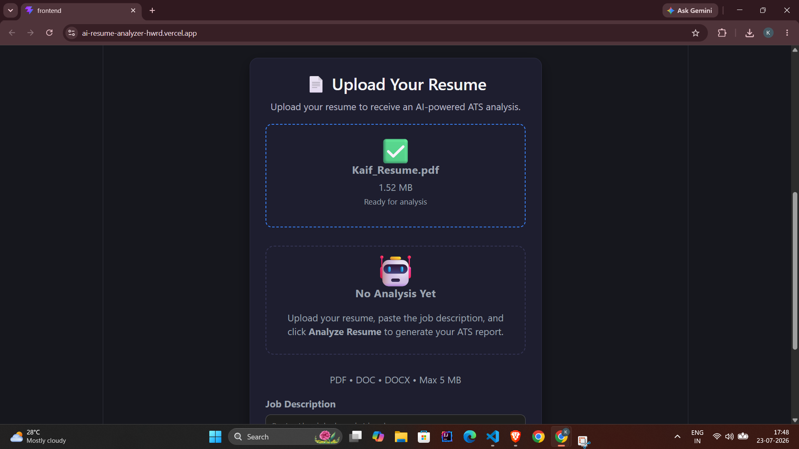
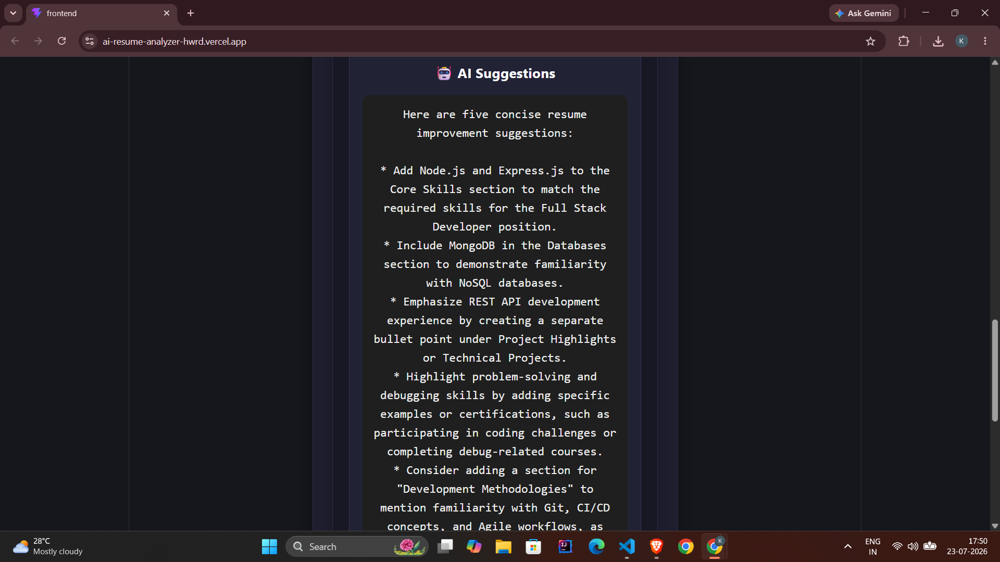

# 🚀 AI Resume Analyzer


> **Analyze • Improve • Get Hired**

An AI-powered Resume Analyzer that evaluates resumes using **ATS scoring**, extracts skills, detects missing keywords, analyzes resume sections, and generates intelligent resume improvement suggestions using **Groq Llama 3.3**.

---

## 🌐 Live Demo

### 🔗 Frontend
**https://ai-resume-analyzer-hwrd.vercel.app/**

### ⚙️ Backend API
**https://ai-resume-analyzer-fk1n.onrender.com**

---

# ✨ Features

- 📄 Upload PDF resumes
- 🎯 ATS Compatibility Score
- 🤖 AI-powered Resume Suggestions
- 🔍 Skill Extraction
- 📌 Missing Skills Detection
- 📑 Resume Section Analysis
- ⚡ Powered by Groq Llama 3.3
- 📱 Fully Responsive UI
- ☁️ Cloud Deployed (Vercel + Render)

---

# 📸 Screenshots

> Add screenshots inside an `assets` folder.

## 🏠 Home Page



---

## 📄 Resume Upload



---

## 📊 ATS Analysis


---

## 🤖 AI Suggestions



---

# 🛠️ Tech Stack

## Frontend

- React.js
- Vite
- CSS3

## Backend

- Node.js
- Express.js
- Multer
- pdf-parse

## Artificial Intelligence

- Groq API
- Llama 3.3 70B Versatile

## Deployment

- Vercel
- Render

## Version Control

- Git
- GitHub

---

# 🏗️ System Architecture

```text
                 +----------------------+
                 |    React Frontend    |
                 |      (Vercel)        |
                 +----------+-----------+
                            |
                            |
                            ▼
                 +----------------------+
                 |   Express Backend    |
                 |      (Render)        |
                 +----------+-----------+
                            |
        +-------------------+-------------------+
        |                   |                   |
        ▼                   ▼                   ▼
 PDF Parser           ATS Engine         Skill Extractor
        |                   |                   |
        +-------------------+-------------------+
                            |
                            ▼
                 Resume Section Analyzer
                            |
                            ▼
                  Groq API (Llama 3.3)
                            |
                            ▼
                AI Resume Suggestions
```

---

# 📂 Project Structure

```text
AI-Resume-Analyzer
│
├── backend
│   ├── server.js
│   ├── aiSuggestion.js
│   ├── atsScorer.js
│   ├── parser.js
│   ├── skillExtractor.js
│   ├── sectionExtractor.js
│   ├── package.json
│   └── uploads
│
├── frontend
│   ├── public
│   ├── src
│   ├── package.json
│   └── vite.config.js
│
├── assets
│   ├── home.png
│   ├── upload.png
│   ├── ats.png
│   └── suggestions.png
│
└── README.md
```

---

# ⚙️ Installation

## Clone Repository

```bash
git clone https://github.com/KaifCodeur/AI-Resume-Analyzer.git
```

---

## Backend Setup

```bash
cd backend

npm install

npm start
```

---

## Frontend Setup

```bash
cd frontend

npm install

npm run dev
```

---

# 🔑 Environment Variables

Create a `.env` file inside the `backend` directory.

```env
GROQ_API_KEY=your_groq_api_key
```

---

# 📡 API Endpoint

### Analyze Resume

```http
POST /upload
```

Returns:

- ATS Score
- Extracted Skills
- Missing Skills
- Resume Sections
- AI Suggestions

---

# 🚀 Deployment

| Service | Platform |
|----------|----------|
| Frontend | Vercel |
| Backend | Render |
| AI Model | Groq Llama 3.3 |

---

# 🎯 Future Improvements

- 🔐 User Authentication
- 📂 Resume History
- 📥 Download AI Suggestions as PDF
- 📊 Resume Comparison
- 🌙 Dark Mode
- 📄 DOCX Support
- 🌍 Multi-language Support

---

# 👨‍💻 Author

## Shaik Mohammed Kaif

Computer Science Engineer (AI & ML)

- GitHub: https://github.com/KaifCodeur
- LinkedIn: **https://www.linkedin.com/in/kaifshaikmd/**

---

# ⭐ Support

If you found this project helpful, please consider giving it a ⭐ on GitHub.

It helps the project reach more developers and supports future improvements.

---

# 📜 License

This project is licensed under the **MIT License**.
